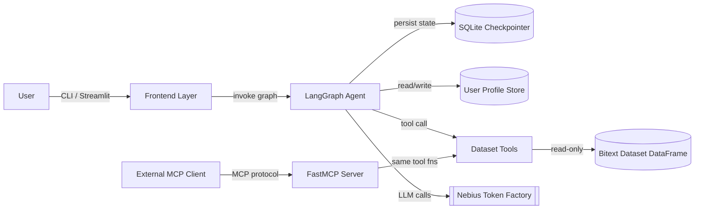
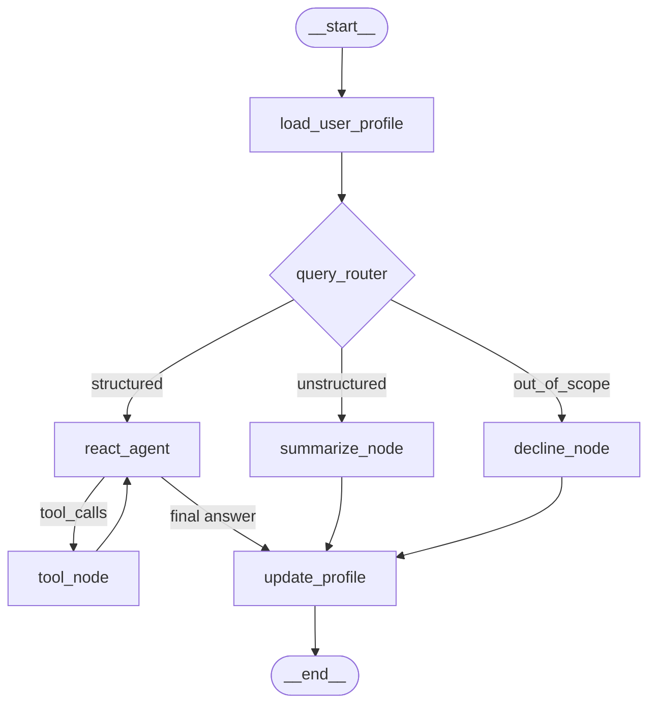
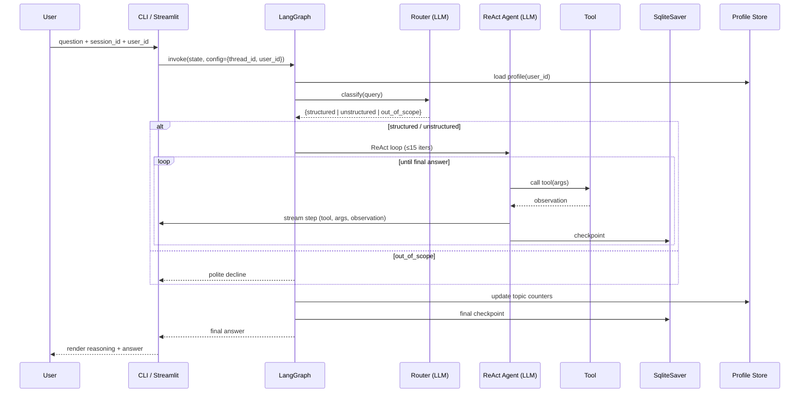

# Design Document

## Overview

The Customer Service Data Analyst Agent is a LangGraph ReAct agent that answers questions about the [Bitext Customer Service Tagged Training Dataset](https://huggingface.co/datasets/bitext/Bitext-customer-support-llm-chatbot-training-dataset). The system loads the dataset once at startup, exposes a fixed set of typed dataset tools, and uses a dedicated **Query Router** node to classify each user query as `structured`, `unstructured`, or `out_of_scope` before routing to the appropriate execution path.

All language-model calls (routing, summarization, ReAct reasoning) go exclusively through the **Nebius Token Factory** API, which is OpenAI-compatible and accessible from `langchain-openai`'s `ChatOpenAI` by overriding `base_url`. Conversation state is persisted via LangGraph's `SqliteSaver` checkpointer (with `PostgresSaver` as a drop-in alternative), and per-user profile data is stored in a separate keyed JSON store. The same agent graph is reused by three frontends: a CLI (`python main.py`), a FastMCP server (`python mcp_server.py`), and an optional Streamlit chat (`streamlit run app.py`).

### Key Design Decisions

| Decision | Choice | Rationale |
|---|---|---|
| Agent framework | LangGraph (`create_react_agent` + custom router node) | Required by spec; gives explicit control over routing and state. |
| LLM provider | Nebius Token Factory via `ChatOpenAI(base_url=...)` | Mandated by Requirement 9; OpenAI-compatible so existing LangChain tooling works unchanged. |
| Default model | `meta-llama/Meta-Llama-3.1-70B-Instruct` (configurable) | Strong tool-calling support, widely available on Nebius, good cost/quality tradeoff for analytical reasoning. |
| Dataset backend | pandas DataFrame loaded at startup | Bitext dataset is small (~27k rows); in-memory filtering is O(n) and trivial. |
| Tool schemas | Pydantic v2 `BaseModel` | Required by Requirement 3.9; LangChain and FastMCP both consume Pydantic schemas natively. |
| Checkpointer | `SqliteSaver` (default), `PostgresSaver` (opt-in) | Required by Requirement 6; SQLite is zero-config for local use. |
| User profile store | JSON file keyed by user_id under `./profiles/` | Simple, inspectable, and independent of the conversation checkpointer (so profile survives session deletion). |
| MCP framework | FastMCP | Required by Requirement 8.1; reuses the same Pydantic-typed tool functions. |

## Architecture

### High-Level System View



### LangGraph Node Graph



Notes:
- `load_user_profile` reads the user profile keyed by `user_id` from the conversation `config` and injects it into the graph state.
- `query_router` is a single Nebius LLM call with a focused classification prompt and **no tool bindings**, satisfying Requirement 2.5.
- `react_agent` is built with LangGraph's prebuilt `create_react_agent`, configured with `recursion_limit=15` to satisfy the iteration cap (Requirement 4.2).
- `summarize_node` is a small ReAct subgraph that allows additional structured tool calls before producing a narrative summary (Requirement 2.4).
- `decline_node` returns a static polite refusal and bypasses any LLM general-knowledge response (Requirement 2.2).
- `update_profile` increments topic frequency counters and persists the profile after each turn (Requirements 7.4, 7.5).
- The checkpointer wraps the **compiled** graph, so every state transition (router → ReAct → tool → answer) is checkpointed automatically (Requirement 6.4).

### Request Lifecycle



### Project Layout

```
.
├── main.py                  # CLI entry point
├── mcp_server.py            # FastMCP server entry point
├── app.py                   # (bonus) Streamlit entry point
├── requirements.txt
├── README.md
├── checkpoints.db           # default SqliteSaver path (gitignored)
├── profiles/                # one JSON file per user_id (gitignored)
│   └── default.json
├── data/
│   └── bitext_customer_service.csv
└── src/
    └── csa_agent/
        ├── __init__.py
        ├── config.py            # env var loading; dataset path; model name
        ├── llm.py               # Nebius ChatOpenAI factory
        ├── dataset.py           # load + validate Bitext dataset
        ├── tools/
        │   ├── __init__.py
        │   ├── schemas.py       # Pydantic models for all tool inputs
        │   └── core.py          # the 7 dataset tools
        ├── router.py            # Query Router node
        ├── nodes.py             # decline_node, summarize_node, profile nodes
        ├── graph.py             # builds the LangGraph and binds tools
        ├── profile.py           # UserProfile + JSON store
        ├── checkpointer.py      # SqliteSaver / PostgresSaver factory
        └── recommender.py       # (bonus) Query Recommender
```

## Components and Interfaces

### Configuration (`config.py`)

A single `Settings` object loaded from environment variables at startup.

| Field | Env var | Default | Notes |
|---|---|---|---|
| `nebius_api_key` | `NEBIUS_API_KEY` | (required) | Empty/missing → exit non-zero (Req 9.4). |
| `nebius_base_url` | `NEBIUS_BASE_URL` | `https://api.studio.nebius.ai/v1/` | Override for staging. |
| `nebius_model` | `NEBIUS_MODEL` | `meta-llama/Meta-Llama-3.1-70B-Instruct` | Documented in README (Req 9.5). |
| `dataset_path` | `BITEXT_DATASET_PATH` | `./data/bitext_customer_service.csv` | Used by `dataset.load_dataset`. |
| `checkpoint_db` | `CHECKPOINT_DB` | `./checkpoints.db` | Or CLI `--checkpoint-db` (Req 6.6). |
| `profile_dir` | `PROFILE_DIR` | `./profiles` | One JSON per user_id. |
| `max_iterations` | `MAX_ITERATIONS` | `15` | Hard cap (Req 4.2). |

### LLM Factory (`llm.py`)

```python
def get_llm(temperature: float = 0.0, model: str | None = None) -> ChatOpenAI:
    """Return a ChatOpenAI bound to Nebius Token Factory.

    All LLM calls in the system go through this factory (Req 9.1, 9.2).
    """
```

The factory enforces two invariants: (1) `base_url` always points to Nebius, (2) `api_key` is read from `Settings.nebius_api_key`. There is no other LLM constructor in the codebase, satisfying Requirement 9.2 by construction.

### Dataset Loader (`dataset.py`)

```python
REQUIRED_COLUMNS = {"utterance", "category", "intent"}

def load_dataset(path: str) -> pd.DataFrame:
    """Load Bitext CSV/parquet and validate columns.

    Raises FileNotFoundError if path missing (Req 1.2).
    Raises ValueError listing missing columns if schema invalid (Req 1.4).
    """
```

The DataFrame is loaded once and passed to tools via a closure or a module-level singleton, never reloaded per call (Req 1.5).

### Dataset Tools (`tools/core.py`)

Each tool is a `@tool`-decorated function with a Pydantic input schema. All tools take the loaded `DataFrame` via closure capture in a `build_tools(df) -> list[BaseTool]` factory.

| Tool | Input schema fields | Output |
|---|---|---|
| `list_categories` | (none) | `list[str]` of distinct categories |
| `filter_by_intent` | `intent: str` | `list[dict]` of matching rows (capped at 100 to keep token budget reasonable; full count returned via `count_rows`) |
| `filter_by_category` | `category: str` | same shape as above |
| `count_rows` | `category: str \| None`, `intent: str \| None` | `int` |
| `show_examples` | `category: str \| None`, `intent: str \| None`, `n: int` (1–50) | `list[str]` of utterances |
| `get_intent_distribution` | `category: str` | `dict[str, int]` (intent → count) |
| `summarize_category` | `category: str` | `str` (LLM-generated summary grounded in dataset rows) |

All tools return a structured error object `{"error": "...", "value": "..."}` instead of raising when a category/intent is missing (Req 3.8). `show_examples` clamps `n` to `[1, 50]`.

### Query Router (`router.py`)

A single function that takes the latest user message and returns one of three string labels.

```python
class RouteLabel(str, Enum):
    STRUCTURED = "structured"
    UNSTRUCTURED = "unstructured"
    OUT_OF_SCOPE = "out_of_scope"

def classify_query(user_query: str, llm: ChatOpenAI) -> RouteLabel:
    """Single LLM call with a focused prompt; no tool bindings (Req 2.5)."""
```

The prompt instructs the model to:
- Return `structured` for queries answerable by filtering/counting the dataset (e.g., "How many refund requests are there?").
- Return `unstructured` for narrative/summary requests grounded in the dataset (e.g., "Summarize the FEEDBACK category").
- Return `out_of_scope` for anything else (general world knowledge, opinions, topics unrelated to the Bitext customer service dataset).
- Output strictly one of the three labels (parsed with structured output via `with_structured_output(RouteLabel)`).

### Decline Node (`nodes.py`)

Returns a fixed, dataset-aware refusal:

> "I can only answer questions about the Bitext Customer Service training dataset (categories, intents, utterances, counts, and summaries). I won't answer that out-of-scope question."

No LLM is invoked in this branch, satisfying Req 2.2.

### Summarize Node (`nodes.py`)

A small ReAct subgraph bound to the structured tools (`count_rows`, `show_examples`, `get_intent_distribution`) plus a system prompt instructing the model to ground its summary in actual dataset facts. Implements Req 2.4.

### ReAct Agent (`graph.py`)

Built with `create_react_agent(model, tools, checkpointer, state_modifier)` from `langgraph.prebuilt`. The `state_modifier` injects:
- The user profile (Req 7.3 enables "What do you remember about me?").
- A reminder that all answers must be grounded in tool observations.

Streaming uses `graph.stream(..., stream_mode="updates")`, and the CLI prints each tool call name + observation as updates arrive (Req 4.4, 5.4).

### Profile Store (`profile.py`)

```python
class UserProfile(BaseModel):
    user_id: str
    name: str | None = None
    frequent_topics: list[str] = []
    preferences: dict[str, str] = {}
    topic_counts: dict[str, int] = {}  # internal counter for Req 7.4

def load_profile(user_id: str) -> UserProfile: ...
def save_profile(profile: UserProfile) -> None: ...
def record_topic(profile: UserProfile, topic: str) -> UserProfile:
    """Increment counter; if count >= 3 add to frequent_topics (Req 7.4)."""
```

Profiles live at `./profiles/{user_id}.json`. Atomic writes via temp file + rename to avoid partial writes.

### Checkpointer (`checkpointer.py`)

```python
def get_checkpointer(db_path: str) -> SqliteSaver:
    """SqliteSaver by default; PostgresSaver if POSTGRES_URL is set."""
```

The checkpointer is created with `SqliteSaver.from_conn_string(db_path)` and passed to `graph.compile(checkpointer=...)`. LangGraph automatically persists state at every super-step, satisfying Req 6.4.

### CLI (`main.py`)

```
python main.py [--session SESSION_ID] [--user USER_ID] [--checkpoint-db PATH]
```

Behavior:
- If `--session` omitted, generates `uuid4()` and prints it (Req 5.3).
- If `--user` omitted, defaults to `"default"` (Req 7.6).
- Reads input in a loop; `exit` or `quit` ends the loop (Req 5.5).
- For each user query, calls `graph.stream(...)` and prints `🔧 tool_name(args) → observation` lines as they arrive, then prints the final answer (Req 4.4, 5.4).

### MCP Server (`mcp_server.py`)

Uses FastMCP. Exposes the same tool functions used by the agent — `list_categories`, `count_rows`, `show_examples`, `filter_by_category`, `get_intent_distribution` — by registering them with `@mcp.tool()`. Started with `python mcp_server.py` (Req 8.3). On invalid input, FastMCP automatically returns a structured error from Pydantic validation (Req 8.5).

### Streamlit UI (`app.py`, optional)

Uses `st.chat_input` + `st.chat_message`. Sidebar contains a session ID input (Req 11.2). On each submit, calls the same compiled graph and writes streaming updates into an `st.status` block so the user sees reasoning steps before the final answer (Req 11.1, 11.3). Launches with `streamlit run app.py` (Req 11.4).

### Query Recommender (`recommender.py`, optional)

Triggered when the user asks "What should I query next?" (matched at the router level as a special intent). Uses an LLM call with the User Profile and recent message history to generate ≥ 3 suggestions, presents them, and waits for explicit confirmation/refinement before invoking the normal routing path (Req 12.1–12.5).

## Data Models

### Pydantic Tool Input Schemas

```python
class ListCategoriesInput(BaseModel):
    """No parameters required."""
    pass

class FilterByIntentInput(BaseModel):
    intent: str = Field(..., description="Exact intent name (e.g., 'track_refund')")

class FilterByCategoryInput(BaseModel):
    category: str = Field(..., description="Exact category name (e.g., 'REFUND')")

class CountRowsInput(BaseModel):
    category: str | None = Field(None, description="Optional category filter")
    intent: str | None = Field(None, description="Optional intent filter")

class ShowExamplesInput(BaseModel):
    category: str | None = Field(None)
    intent: str | None = Field(None)
    n: int = Field(5, ge=1, le=50, description="Number of examples (1–50)")

class GetIntentDistributionInput(BaseModel):
    category: str = Field(..., description="Exact category name")

class SummarizeCategoryInput(BaseModel):
    category: str = Field(..., description="Exact category name")
```

### Tool Result Envelope

To honor Req 3.8 (no unhandled exceptions on missing values), every tool returns one of:

```python
class ToolError(BaseModel):
    error: str             # short error code, e.g. "category_not_found"
    message: str           # human-readable
    value: str | None      # the offending value, when applicable
```

A successful result is the tool's natural type (`list[str]`, `int`, `dict[str, int]`, ...). Tool functions always return either the success type or a `ToolError`-shaped dict.

### LangGraph State

```python
class AgentState(TypedDict):
    messages: Annotated[list[BaseMessage], add_messages]
    route: RouteLabel | None        # set by query_router
    user_profile: UserProfile        # loaded by load_user_profile
    iterations: int                  # incremented per tool call; capped at 15
```

### User Profile

```python
class UserProfile(BaseModel):
    user_id: str
    name: str | None = None
    frequent_topics: list[str] = []                    # Req 7.1, 7.4
    preferences: dict[str, str] = {}                   # Req 7.1
    topic_counts: dict[str, int] = {}                  # internal: count occurrences
    created_at: datetime = Field(default_factory=datetime.utcnow)
    updated_at: datetime = Field(default_factory=datetime.utcnow)
```

Persisted at `{profile_dir}/{user_id}.json` with atomic write (Req 7.5).

### Checkpoint Config

LangGraph identifies threads via `config["configurable"]["thread_id"]` (= session ID) and we additionally pass `config["configurable"]["user_id"]` so nodes can load the right profile (Req 6.2, 5.6).

### Dataset Schema

Validated at startup; any missing column → exit non-zero (Req 1.3, 1.4).

| Column | Type | Notes |
|---|---|---|
| `utterance` | `str` | The customer message text |
| `category` | `str` | Top-level grouping (e.g., `REFUND`) |
| `intent` | `str` | Specific intent (e.g., `track_refund`) |
| Optional tag columns | `str` | Preserved but not validated; surfaced when present |


## Correctness Properties

*A property is a characteristic or behavior that should hold true across all valid executions of a system — essentially, a formal statement about what the system should do. Properties serve as the bridge between human-readable specifications and machine-verifiable correctness guarantees.*

The dataset tools, query router, persistence layer, and LLM-provider invariant are all amenable to property-based testing: they have clear inputs/outputs, large input spaces, and universal invariants. UI rendering (Streamlit), README content, and process-startup behaviors are covered by example/integration tests instead (see Testing Strategy).

### Property 1: list_categories is the deduplicated category column

*For any* loaded dataset DataFrame `df` containing a `category` column, `list_categories(df)` returns a list with no duplicates whose set equals `set(df["category"])`.

**Validates: Requirements 3.1**

### Property 2: filter_by_* returns exactly the matching rows

*For any* DataFrame `df` and *for any* string `value`, `filter_by_intent(df, value)` returns exactly the rows in `df` where `df.intent == value`, and `filter_by_category(df, value)` returns exactly the rows where `df.category == value`.

**Validates: Requirements 3.2, 3.3**

### Property 3: count_rows is consistent with the filter tools

*For any* DataFrame `df` and *for any* optional `category` and optional `intent`, `count_rows(df, category, intent)` equals the length of the row set produced by applying the same filters via `filter_by_category` ∩ `filter_by_intent`.

**Validates: Requirements 3.4**

### Property 4: get_intent_distribution is consistent with count_rows

*For any* DataFrame `df` and *for any* `category` present in `df`, `sum(get_intent_distribution(df, category).values()) == count_rows(df, category=category)`, and every key of the distribution is an intent that appears in rows whose category equals `category`.

**Validates: Requirements 3.6**

### Property 5: show_examples is bounded and grounded

*For any* DataFrame `df`, *for any* filter (`category` and/or `intent`), and *for any* integer `n` in `[1, 50]`, `show_examples(df, ..., n)` returns a list whose length is at most `min(n, matching_count)`, and every returned utterance appears in the `utterance` column of the matching subset of `df`.

**Validates: Requirements 3.5**

### Property 6: Tools return structured errors for missing values

*For any* string `s` that does not appear as a category or intent in `df`, every dataset tool that takes a category/intent parameter returns a `ToolError`-shaped result (with `error` and `value` fields) and does not raise an exception.

**Validates: Requirements 3.8**

### Property 7: Query Router output is well-formed

*For any* user query string and *for any* LLM raw output, `classify_query` returns a value that is a member of `RouteLabel` (`structured`, `unstructured`, or `out_of_scope`).

**Validates: Requirements 2.1**

### Property 8: Decline path is pure

*For any* query that the router classifies as `out_of_scope`, the downstream graph emits the decline message and makes zero additional LLM calls and zero tool invocations.

**Validates: Requirements 2.2, 2.5**

### Property 9: Routing matches classification

*For any* query, the next graph node visited after the router matches the router's classification: `structured` → ReAct agent, `unstructured` → summarize node, `out_of_scope` → decline node.

**Validates: Requirements 2.3, 2.4**

### Property 10: ReAct agent terminates within the iteration cap

*For any* user query and *for any* mocked LLM behavior, the ReAct agent terminates after at most 15 reasoning iterations and the final state contains a non-empty user-visible message (no unhandled exception, no infinite loop).

**Validates: Requirements 4.2, 4.3**

### Property 11: Tool calls are streamed before the final answer

*For any* run that produces at least one tool call, every tool-call event appears in the streamed update sequence strictly before the final-answer event.

**Validates: Requirements 4.4, 5.4, 11.3**

### Property 12: Profile round-trip and topic counter

*For any* `UserProfile` value `p`, `load_profile(save_profile(p).user_id)` returns a profile equal to `p`. *For any* topic string `t` and *for any* sequence of `record_topic` invocations, `t` is in `frequent_topics` if and only if the recorded count for `t` is at least 3.

**Validates: Requirements 7.4, 7.5**

### Property 13: Checkpointer preserves message order across reopens

*For any* sequence of messages `m1, m2, ..., mn` written to thread `T` via the compiled graph, after closing and reopening the `SqliteSaver` and reading thread `T`, the recovered messages equal `m1, ..., mn` in order.

**Validates: Requirements 6.2, 6.4**

### Property 14: All LLM clients point at Nebius

*For any* LLM client constructed at runtime, its `base_url` matches the configured `NEBIUS_BASE_URL` (i.e., the Nebius factory is the only LLM constructor in use).

**Validates: Requirements 9.1, 9.2**

### Property 15: MCP tool calls match direct tool calls

*For any* exposed MCP tool and *for any* valid input, the result returned by the FastMCP server equals the result returned by calling the underlying tool function directly. *For any* input that violates the tool's Pydantic schema, the MCP server returns a structured error response and does not raise.

**Validates: Requirements 8.2, 8.5**

### Property 16: Recommender requires confirmation (bonus)

*For any* generated suggestion set, the Query Recommender returns at least 3 suggestions and zero downstream queries are executed until an explicit user confirmation event is observed.

**Validates: Requirements 12.1, 12.2, 12.5**

## Error Handling

The system distinguishes three classes of errors: **fatal startup errors**, **per-turn recoverable errors**, and **per-tool structured errors**.

### Fatal Startup Errors (exit non-zero)

These are detected before the CLI accepts user input and result in a clear stderr message plus `sys.exit(1)`:

| Condition | Source | Message shape | Requirement |
|---|---|---|---|
| `NEBIUS_API_KEY` missing/empty | `config.get_settings()` | `"NEBIUS_API_KEY is not set. Set it before launching the agent."` | 9.4 |
| Dataset path not found | `dataset.load_dataset()` | `"Dataset file not found at <path>"` | 1.2 |
| Required columns missing | `dataset.load_dataset()` | `"Dataset is missing required columns: [...]; found: [...]"` | 1.4 |
| Invalid `--checkpoint-db` path (parent dir not writable) | `checkpointer.get_checkpointer()` | `"Cannot write checkpoint database at <path>: <reason>"` | 6.6 |

### Per-Turn Recoverable Errors

These do not crash the CLI; they emit an error message to the user and the loop continues:

| Condition | Behavior | Requirement |
|---|---|---|
| Checkpointer write fails mid-turn | Catch, surface error to user, do **not** acknowledge turn as completed; the user can retry | 6.5 |
| LLM API call fails (network/quota) | Catch, surface friendly error, log details; do not partially update profile | implicit |
| Iteration cap reached | Emit `"I couldn't complete this query within 15 reasoning steps. Here's what I have so far: ..."` | 4.3 |
| Out-of-scope classification | Emit canonical decline string; no LLM general-knowledge fallback | 2.2 |

### Per-Tool Structured Errors

Tools never raise on missing categories/intents. They return:

```python
{
    "error": "category_not_found" | "intent_not_found" | "invalid_n",
    "message": "<human-readable>",
    "value": "<offending input>"
}
```

This shape is what the ReAct agent observes as its tool result, allowing the model to recover (e.g., by calling `list_categories` and retrying with a corrected name) — directly addressing Requirements 3.8 and 8.5.

### Profile-Update Failures

Profile saves are best-effort and never block the main response. Failures are logged with the offending `user_id`. This is intentional: a corrupt profile should not prevent the user from getting answers about the dataset.

## Testing Strategy

### Test Pyramid

```
            ┌─────────────────────┐
            │ E2E (CLI subprocess)│   ~5 tests
            └─────────────────────┘
          ┌───────────────────────────┐
          │ Integration (graph + db)  │   ~15 tests
          └───────────────────────────┘
        ┌─────────────────────────────────┐
        │ Property tests (Hypothesis)     │   ~16 properties × 100+ iters
        └─────────────────────────────────┘
      ┌─────────────────────────────────────┐
      │ Unit / example tests                │   ~30 tests
      └─────────────────────────────────────┘
```

### Tooling

- **Test runner**: `pytest`.
- **Property-based testing**: [Hypothesis](https://hypothesis.readthedocs.io/) — Python's de-facto PBT library; integrates natively with pytest.
- **Coverage**: `pytest-cov` with a soft threshold of 85% on `src/csa_agent/`.
- **LLM mocking**: a `FakeChatModel` that returns scripted messages or scripted tool calls; used everywhere the real Nebius LLM would be invoked. This keeps property tests cheap (well under a second per iteration).
- **Network spy**: `pytest-httpx` or a request-recording transport injected into the Nebius client to assert `base_url` (Property 14).
- **Streamlit testing**: `streamlit.testing.v1.AppTest` for the optional UI tests.

### Property-Based Testing Configuration

- Each property test runs **at least 100 examples** via `@settings(max_examples=100, deadline=None)`.
- Each property test is tagged with a docstring of the form:
  `Feature: customer-service-data-analyst-agent, Property {N}: {property_text}`
- Hypothesis strategies live in `tests/strategies.py` and include:
  - `dataframes_st()` — random DataFrames with `utterance`, `category`, `intent` columns drawn from small finite alphabets, ensuring non-trivial overlap so filters return non-empty results in many cases.
  - `non_existent_string_st(df)` — strings prefixed with a guaranteed-absent sentinel to exercise Property 6.
  - `user_profiles_st()` — profiles with random names, topics, and preferences.
  - `message_sequences_st()` — `BaseMessage` lists with mixed `HumanMessage` / `AIMessage` / `ToolMessage`.

### Mapping: Properties → Test Modules

| Property | Test module | Notes |
|---|---|---|
| P1–P5 | `tests/test_tools_property.py` | Pure-function tests over generated DataFrames. |
| P6 | `tests/test_tools_errors_property.py` | Uses `non_existent_string_st`. |
| P7 | `tests/test_router_property.py` | Mocks LLM raw output to return arbitrary strings. |
| P8, P9 | `tests/test_routing_branches.py` | Patches `classify_query` to return each label. |
| P10 | `tests/test_react_iteration_cap.py` | Mocked LLM that always emits a tool call. |
| P11 | `tests/test_streaming_order.py` | Asserts event-order invariant. |
| P12 | `tests/test_profile_property.py` | Round-trip + counter property. |
| P13 | `tests/test_checkpointer_property.py` | Sqlite round-trip across open/close cycles. |
| P14 | `tests/test_llm_provider_invariant.py` | Network spy + static AST scan for forbidden imports. |
| P15 | `tests/test_mcp_property.py` | Spawns FastMCP test client; compares results. |
| P16 | `tests/test_recommender_property.py` | Bonus, only run when recommender is enabled. |

### Example/Integration Tests

For criteria not amenable to PBT (UI rendering, CLI startup, README content):

- `tests/test_dataset_loading.py` — fixture CSVs for happy/missing-file/missing-column cases (Reqs 1.1–1.5).
- `tests/test_cli_smoke.py` — subprocess spawn of `python main.py` with scripted stdin (Reqs 5.1, 5.2, 5.5, 5.6).
- `tests/test_settings.py` — env var loading and missing-key exit (Reqs 6.6, 9.3, 9.4).
- `tests/test_react_multi_step.py` — scripted ReAct flow combining `filter_by_category` then `count_rows` (Req 4.1).
- `tests/test_summarize_node.py` — mocked LLM, asserts the prompt contains representative utterances (Req 3.7).
- `tests/test_profile_followup.py` — scripted "what do you remember about me?" scenario (Req 7.3).
- `tests/test_streamlit_app.py` — Streamlit AppTest harness (Reqs 11.1, 11.2, 11.4).
- `tests/test_repo_hygiene.py` — pinned-versions check on `requirements.txt`, README headings present (Reqs 10.1, 10.2).

### Running the Suite

```bash
pytest                         # full suite
pytest -m "not slow"           # excludes E2E subprocess tests
pytest tests/test_tools_property.py -v   # focused property run
```

### Assumptions and Limitations

- Property tests use a `FakeChatModel`; real Nebius behavior is exercised only by a small number of E2E tests gated behind `RUN_LIVE_NEBIUS=1`.
- "Clear, human-readable" final answers (Req 4.5) and "subtle visual feedback" style requirements are validated by example tests asserting non-empty output and successful render — not by property tests, since aesthetic quality is not a computable property.
- Streamlit and Recommender test modules only run when the optional features are installed/enabled.
