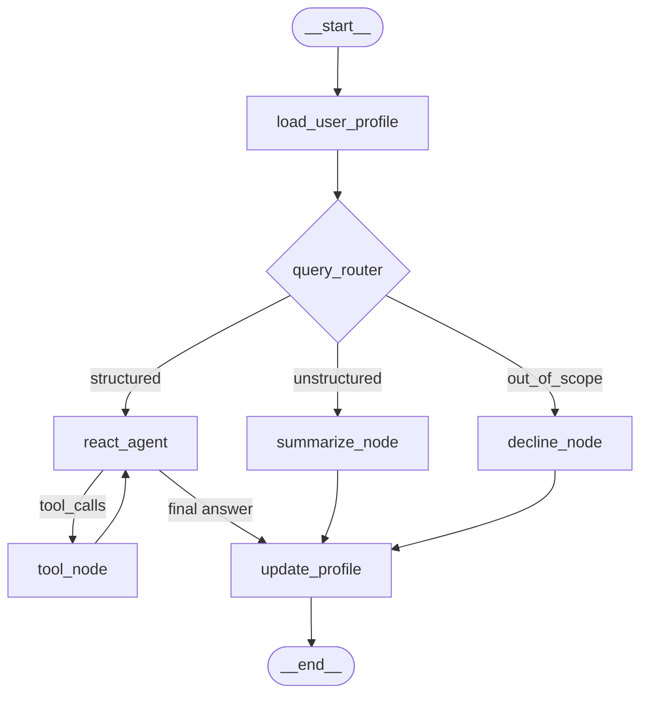

# Customer Service Data Analyst Agent

A LangGraph ReAct agent that answers questions about the
[Bitext Customer Service Tagged Training Dataset](https://huggingface.co/datasets/bitext/Bitext-customer-support-llm-chatbot-training-dataset).
All LLM calls go through the Nebius Token Factory.

The agent ships with three frontends backed by the same compiled graph:

- An interactive CLI (`python main.py`)
- A FastMCP server that exposes the dataset tools to external MCP clients (`python mcp_server.py`)
- An optional Streamlit UI (`streamlit run app.py`)

## 5-minute quickstart

```bash
git clone <this-repo-url>
cd From_AI_Model_to_AI_Agent_Assignment_3_Ariel_Mitiushkin
python -m venv .venv

# macOS / Linux
source .venv/bin/activate
# Windows (PowerShell)
.venv\Scripts\Activate.ps1

pip install -r requirements.txt

cp .env.example .env       # then edit .env and set NEBIUS_API_KEY=<your key>
python main.py             # interactive CLI; type 'exit' to quit
```

If you need a Nebius key, sign up at [studio.nebius.com](https://studio.nebius.com)
and create a static API key. The default model is
`meta-llama/Llama-3.3-70B-Instruct`; if Nebius rotates it (HTTP 404 on a
turn) check `/v1/models` and override `NEBIUS_MODEL` in your `.env`.

## Setup

### 1. Install dependencies

The project targets Python 3.10+. Create a virtual environment and install
from the pinned `requirements.txt`:

```bash
python -m venv .venv
# Windows
.venv\Scripts\activate
# macOS / Linux
source .venv/bin/activate

pip install -r requirements.txt
```

Key dependencies (see `requirements.txt` for the full pinned list):
`langgraph`, `langchain`, `langchain-openai`, `langgraph-checkpoint-sqlite`,
`pandas`, `pydantic`, `python-dotenv`, `fastmcp`, `streamlit`, and
`pytest` + `hypothesis` for the test suite.

### 2. Provide the dataset

The repository ships with the dataset at
`./data/bitext_customer_service.csv`. If you store it elsewhere, point
`BITEXT_DATASET_PATH` at the file. The loader requires the columns
`utterance`, `category`, and `intent`; missing columns cause a hard fail at
startup.

### 3. Configure environment variables

Copy the variables below into a `.env` file at the repo root (or export them
in your shell). Only `NEBIUS_API_KEY` is required; everything else has a
sensible default defined in `src/csa_agent/config.py`.

| Variable              | Purpose                                          | Default                                          |
|-----------------------|--------------------------------------------------|--------------------------------------------------|
| `NEBIUS_API_KEY`      | API key for the Nebius Token Factory (required) | _no default — process exits if missing_         |
| `NEBIUS_BASE_URL`     | OpenAI-compatible base URL                       | `https://api.studio.nebius.ai/v1/`              |
| `NEBIUS_MODEL`        | Default chat model                               | `meta-llama/Llama-3.3-70B-Instruct`             |
| `BITEXT_DATASET_PATH` | Path to the Bitext CSV                           | `./data/bitext_customer_service.csv`            |
| `CHECKPOINT_DB`       | SQLite file for LangGraph checkpoints            | `./checkpoints.db`                              |
| `PROFILE_DIR`         | Directory for per-user profile JSON files        | `./profiles`                                    |
| `MAX_ITERATIONS`      | ReAct recursion cap per turn                     | `15`                                             |

The MCP server reads three additional variables (see the
[MCP Connection](#mcp-connection) section): `MCP_TRANSPORT`, `MCP_HOST`,
`MCP_PORT`.

Example `.env`:

```ini
NEBIUS_API_KEY=sk-...
NEBIUS_MODEL=meta-llama/Llama-3.3-70B-Instruct
BITEXT_DATASET_PATH=./data/bitext_customer_service.csv
CHECKPOINT_DB=./checkpoints.db
PROFILE_DIR=./profiles
```

## CLI Usage

Launch the interactive REPL:

```bash
python main.py
```

The CLI prints a fresh session ID on startup, then accepts one question per
line. Each turn renders every tool call (`🔧 name(args) → observation`) before
the final answer.

```text
$ python main.py
[Session: 7c1b8b1a-8b3a-4f0c-9d2e-1c2a8b4f1d2e]
> What categories are in the dataset?
🔧 list_categories({}) → ['ACCOUNT', 'CANCEL', 'CONTACT', 'DELIVERY', 'FEEDBACK', 'INVOICE', 'ORDER', 'PAYMENT', 'REFUND', 'SHIPPING', 'SUBSCRIPTION']
The dataset contains 11 categories: ACCOUNT, CANCEL, CONTACT, DELIVERY, ...
> exit
```

### Arguments

| Argument           | Purpose                                                        | Default                       |
|--------------------|----------------------------------------------------------------|-------------------------------|
| `--session ID`     | Resume a previous conversation by its session/thread ID        | new UUID printed at startup   |
| `--user ID`        | User identifier used to load and update the per-user profile   | `default`                     |
| `--checkpoint-db PATH` | Path to the SQLite checkpoint database                     | value of `CHECKPOINT_DB`      |

Resuming a previous session restores the full message history so the agent
can answer follow-ups like "show me 5 examples of those":

```bash
python main.py --session 7c1b8b1a-8b3a-4f0c-9d2e-1c2a8b4f1d2e --user alice
```

Use a custom checkpoint database (useful for keeping work isolated per
project):

```bash
python main.py --checkpoint-db ./scratch.db
```

### Exiting

Type `exit` or `quit` (case-insensitive) on a turn to leave the loop
cleanly. `Ctrl+C` and `Ctrl+D` also exit gracefully with a goodbye message.
Empty lines are skipped silently. If a turn fails (e.g. a checkpointer
write error), the CLI surfaces the error with `(turn not acknowledged)` and
keeps the loop running so you can retry.

## MCP Connection

`mcp_server.py` exposes the dataset tools over the
[Model Context Protocol](https://modelcontextprotocol.io) using FastMCP.
Five tools are registered:

- `list_categories` — list distinct category values
- `count_rows` — count rows matching optional `category` / `intent` filters
- `show_examples` — return up to `n` (1–50) representative utterances
- `filter_by_category` — return up to 100 rows for a given category
- `get_intent_distribution` — return `intent → count` for a given category

The MCP-exposed callables are the *same* functions the LangChain ReAct agent
uses — there is one implementation, surfaced two ways.

### Starting the server

The transport is selected via `MCP_TRANSPORT`:

```bash
# Default: stdio (local clients, e.g. Claude Desktop, Cursor)
python mcp_server.py

# SSE (HTTP) — useful for remote clients and quick curl-based testing
MCP_TRANSPORT=sse MCP_HOST=0.0.0.0 MCP_PORT=8000 python mcp_server.py
```

### Example: calling `list_categories`

#### Stdio transport

For stdio the client launches the server as a subprocess and exchanges
JSON-RPC messages over its stdin/stdout. Wired up via the `fastmcp` Python
client:

```python
import asyncio
from fastmcp import Client

async def main():
    # Client launches `python mcp_server.py` as a subprocess and speaks
    # MCP over stdio.
    async with Client("python mcp_server.py") as client:
        result = await client.call_tool("list_categories", {})
        print(result)

asyncio.run(main())
```

For Claude Desktop or Cursor, register the server in your client config
(`claude_desktop_config.json`, etc.):

```json
{
  "mcpServers": {
    "csa-agent": {
      "command": "python",
      "args": ["mcp_server.py"],
      "cwd": "/absolute/path/to/this/repo",
      "env": { "NEBIUS_API_KEY": "sk-..." }
    }
  }
}
```

#### SSE transport

Start the server with `MCP_TRANSPORT=sse` and call it from any MCP client
that speaks SSE:

```python
import asyncio
from fastmcp import Client

async def main():
    async with Client("http://localhost:8000/sse") as client:
        result = await client.call_tool("list_categories", {})
        print(result)

asyncio.run(main())
```

#### Example response

`list_categories` is a no-arg tool that returns the sorted distinct
categories present in the bundled dataset:

```json
[
  "ACCOUNT",
  "CANCEL",
  "CONTACT",
  "DELIVERY",
  "FEEDBACK",
  "INVOICE",
  "ORDER",
  "PAYMENT",
  "REFUND",
  "SHIPPING",
  "SUBSCRIPTION"
]
```

Tools that take arguments use Pydantic-validated input schemas; passing an
unknown category or intent returns a structured error object rather than
raising, e.g. `{"error": "category_not_found", "message": "...", "value": "FOO"}`.

## Architecture

The agent is a LangGraph state machine compiled once and shared across the
CLI, MCP server, and Streamlit UI. A single LLM factory at
`src/csa_agent/llm.py` constructs every Nebius client, which keeps the
"all LLM calls go to Nebius" invariant in one place.

### Node graph



A turn flows through the graph as follows:

1. **`load_user_profile`** reads the user's profile from
   `PROFILE_DIR/<user_id>.json` and injects it into the graph state. The
   profile store is deliberately separate from the checkpointer: profiles
   are keyed by `user_id`, while checkpoints are keyed by `thread_id`
   (session), so the same profile can survive across sessions.
2. **`query_router`** is a single Nebius LLM call with no tool bindings
   that classifies each query as `structured`, `unstructured`, or
   `out_of_scope`. Structured queries (counts, filters, exact lookups) go
   to the ReAct agent; unstructured queries (summaries, narratives) go to
   `summarize_node`; off-topic queries go to `decline_node`, which returns
   a static polite refusal without calling any general-knowledge LLM.
3. **`react_agent`** is built with LangGraph's prebuilt `create_react_agent`,
   bound to the dataset tools and capped at `MAX_ITERATIONS` (15) to
   prevent runaway loops. Tool calls and observations are streamed to the
   frontend so the user sees each reasoning step.
4. **`update_profile`** updates topic-frequency counters and persists the
   profile after every turn.

### Persistence

LangGraph's `SqliteSaver` (`langgraph-checkpoint-sqlite`) wraps the
compiled graph at `CHECKPOINT_DB`, so every state transition (router →
ReAct → tool → answer) is checkpointed automatically. Resuming a session
with `--session <id>` reloads the full message history from the SQLite
file. If a checkpoint write fails mid-turn, the CLI surfaces
`(turn not acknowledged)` and the loop continues so the user can retry.

### LLM factory

`src/csa_agent/llm.py` is the single entry point for constructing chat
models. Both the router and the ReAct agent obtain their clients through
this factory, which reads `NEBIUS_API_KEY`, `NEBIUS_BASE_URL`, and
`NEBIUS_MODEL` from `Settings`. Centralising the factory keeps the
"every LLM call points at Nebius" invariant testable as a single property.

## Model Justification

The default model is **`meta-llama/Llama-3.3-70B-Instruct`**, served
through the Nebius Token Factory. It is a strong fit for this agent for
three reasons:

- **Tool calling.** Llama 3.3 70B Instruct is trained for tool use and works
  reliably with LangChain's OpenAI-compatible tool-calling protocol. The
  ReAct loop here issues structured calls to seven Pydantic-validated
  tools; weaker tool-calling models tend to emit malformed arguments or
  free-text reasoning instead of the JSON the agent expects.
- **Cost-quality tradeoff for analytical reasoning.** Dataset analysis
  queries ("which intents are in the REFUND category?", "summarise the
  top categories") need solid multi-step reasoning but do not require a
  frontier-tier model. The 70B Llama 3.3 sits in a sweet spot for Nebius
  pricing and latency while still handling the router's three-way
  classification and the ReAct agent's planning robustly.
- **Availability on Nebius.** The model is a first-class citizen of the
  Nebius Token Factory catalogue, so the OpenAI-compatible base URL and
  API key are sufficient — no extra deployment steps.

The model is configurable via `NEBIUS_MODEL`. Any Nebius-hosted chat model
that supports OpenAI-style tool calling is a drop-in replacement; for
example, smaller Llama or Qwen variants work for cost-sensitive setups,
and larger models can be used when reasoning quality matters more than
latency. Because every LLM client is built by the single factory in
`src/csa_agent/llm.py`, switching models requires only changing the
environment variable.
